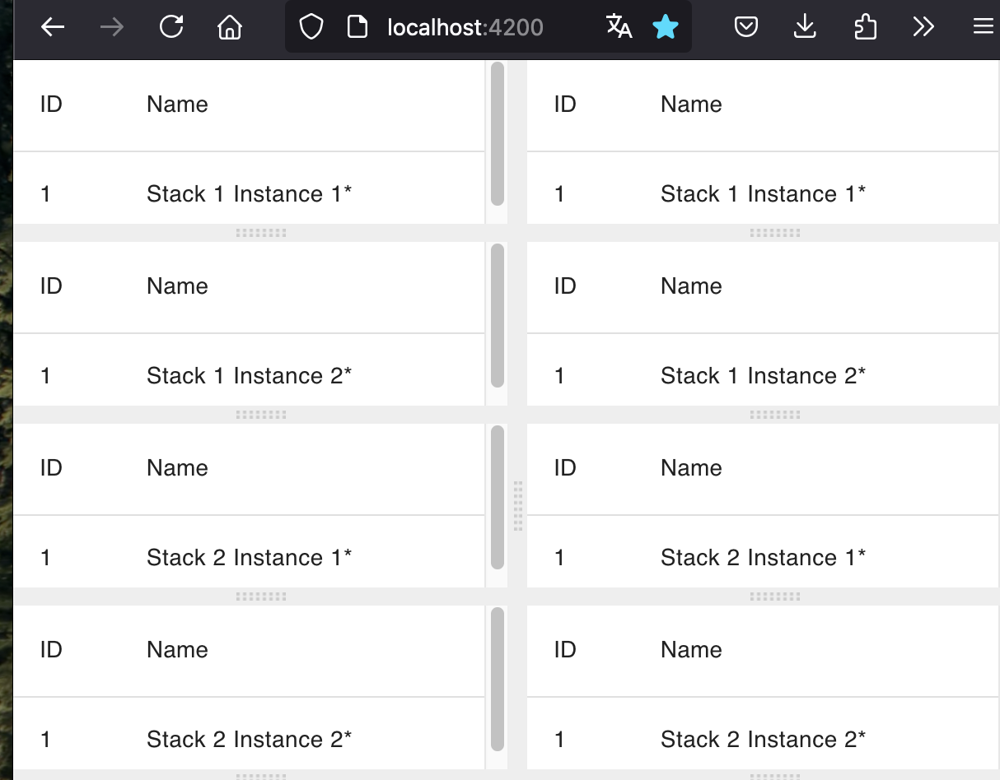

# bistack, a demo of micro stack architecture

gong playground for 4 stack instances with websocket update:

2 stacks ("bistack" & "other stack) x 2 instances per stack X 2 clients



```
git clone https://github.com/thomaspeugeot/bistack.git
cd bistack/ng-github.com-thomaspeugeot-bistack
npm i; ng build
cd ../go/cmd/bistack
go run main.go
```

navigate to http://localhost:8080/
